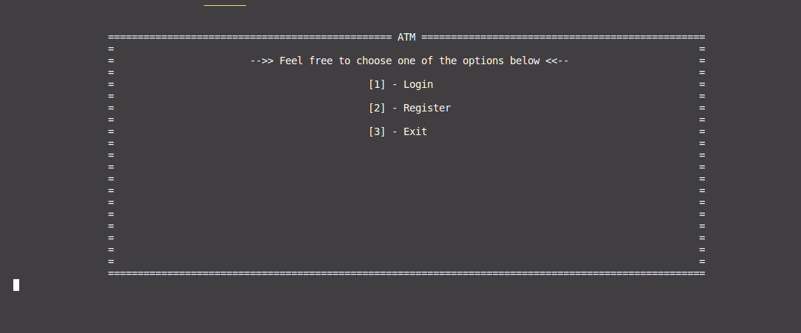
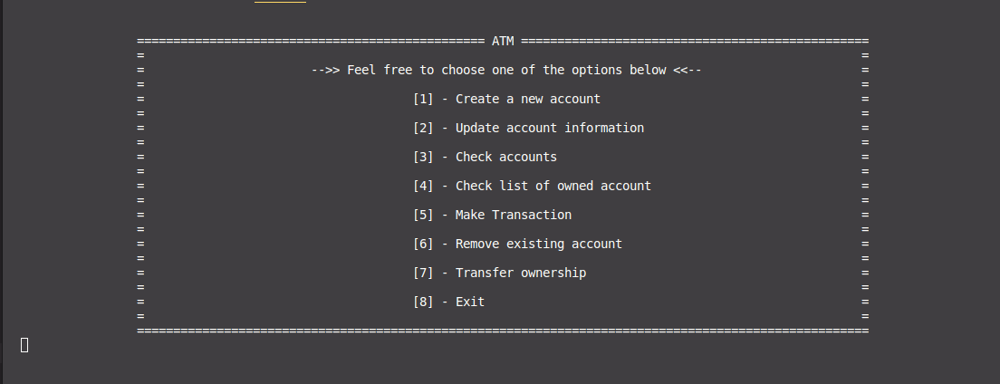
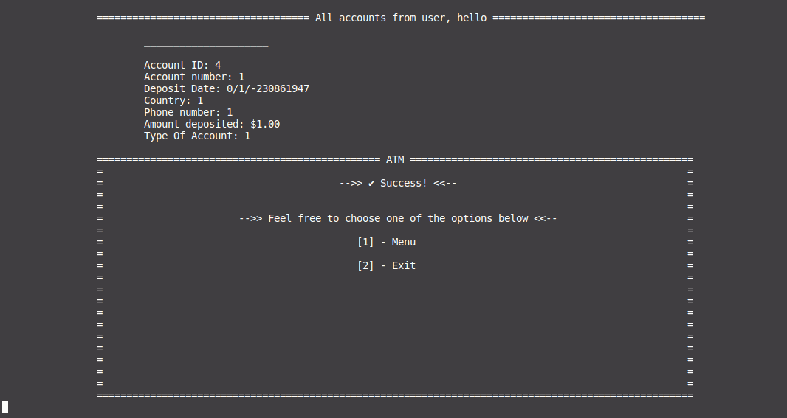
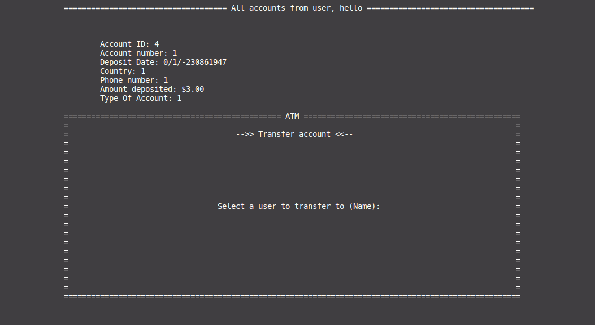

# atm-system

## Table of Contents
- [atm-system](#atm-system)
  - [Table of Contents](#table-of-contents)
  - [General Information](#general-information)
  - [Features](#features)
  - [Technologies Used](#technologies-used)
  - [Team \& My Work](#team--my-work)
  - [Main Learnings](#main-learnings)
  - [Setup](#setup)
  - [Images](#images)

## General Information
This project was made as a school project in [kood/Jõhvi](https://kood.tech/) (05.29.2022)

The project required me to create a CLI ATM System application. The project was given to me in a half finished state so I had to add the missing methods.

  **NB! Different source control platform was used hence no commit history.**

## Features
- Registration of new users
- Authentication
- Money transactions
- User accounts

## Technologies Used

[C](https://en.wikipedia.org/wiki/C_(programming_language))

## Team & My Work
This project had to be done solo.

 The methods I had to implement were: registration of new users, updating existing users data, checking the data of existing users, money transacion, removal of accounts and transfer ownership of accounts. 

## Main Learnings
- Introduction to lower level language like C
- Basics of an CLI app
- Basics of pointers
- Makefile
- *manual memory management* - Who thought that was a good idea? =)

## Setup
Clone the repository
```
git clone https://github.com/JesusKris/atm-system.git
```
Compile an executable
```
make
```
Run the executable
```
./atm
```
## Images




